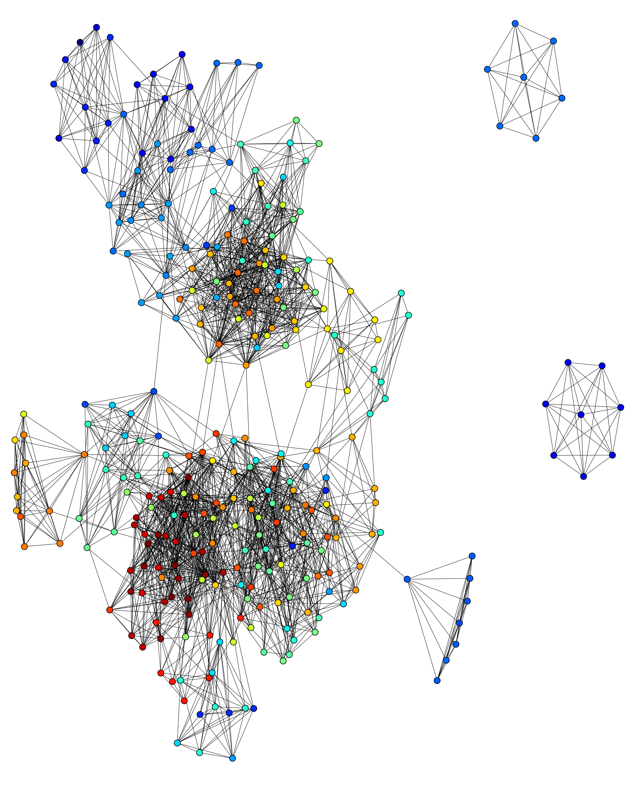

## Setup.
```bash
# Requires : brew install graphviz
# Requires : pip intstall networkx matplotlib pygraphviz
# (creating a nice layout takes a long time for large graphs; large means >2000 nodes)
cd ./graph-manipulation
python displaySimpleGraph_demo.py friendship_graph_undirected.dot neato 7
```
## Input.
This script takes a data file like so : 

```python
strict graph {
  user -- person_they_follow_1;
  user -- person_they_follow_2;
  ...
  user -- person_they_follow_n;
}
```

## Output.
This script outputs a graph like so : 


